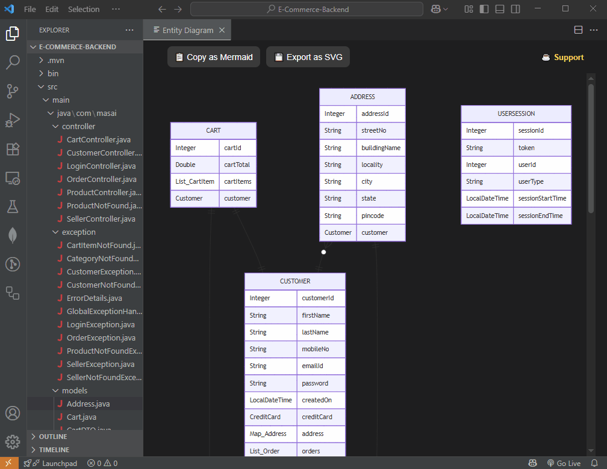

## JPA Visualizer  

*Generate interactive ER diagrams from your Java JPA entities – right inside Visual Studio Code.*

#### ✨ Features
* 🔍 Automatically scans your workspace for `@Entity` classes
* 🧩 Detects fields and JPA relations `(@OneToMany, @ManyToOne, etc.)`
* 🗺️ Generates clean Mermaid ER diagrams in a VS Code webview

* 📤 Export diagrams as **SVG/PNG**

* 📋 Copy **Mermaid code** to clipboard for documentation or sharing

#### 🚀 Quick Start
* Open the command palette `(Ctrl+Shift+P / Cmd+Shift+P)`
* Run `JPA Visualizer: Generate Diagram`

Your entity model appears instantly as an interactive ER diagram

#### ✅ Requirements
* VS Code v1.101.0+
* Java project with JPA annotations

#### 📌 Notes
* Focused on standard JPA annotations
* Complex mappings may be partially visualized

#### 📜 License
* Released under the **Business Source License 1.1 (BUSL-1.1)**

#### Development
Want to build or contribute? See [DEVELOPMENT.md](./docs/DEVELOPMENT.md).

##### Enjoy visualizing your JPA entities!